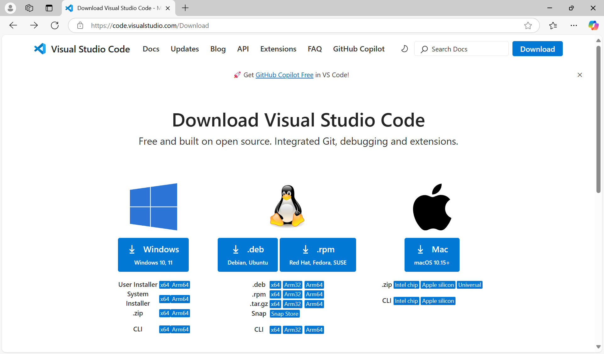
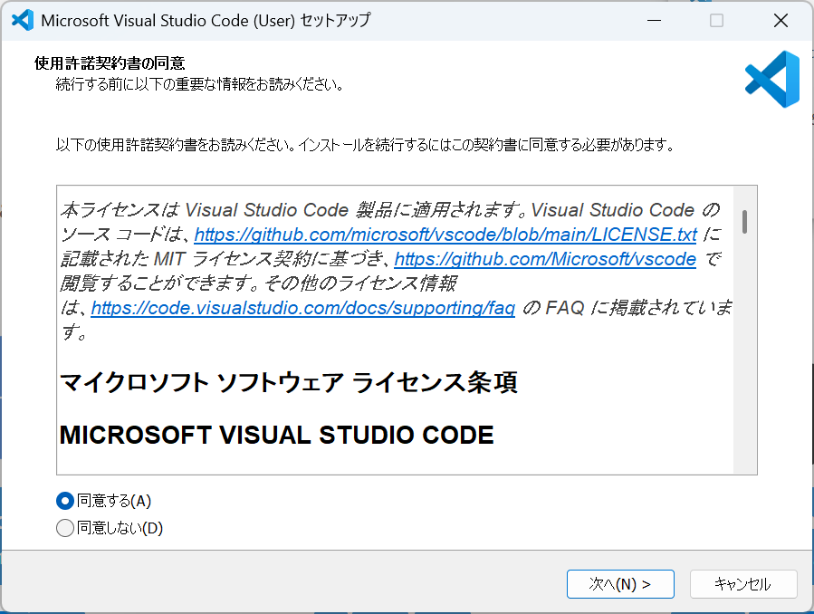
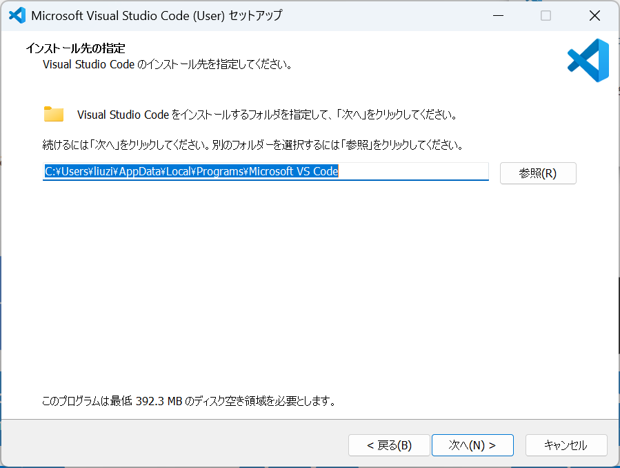
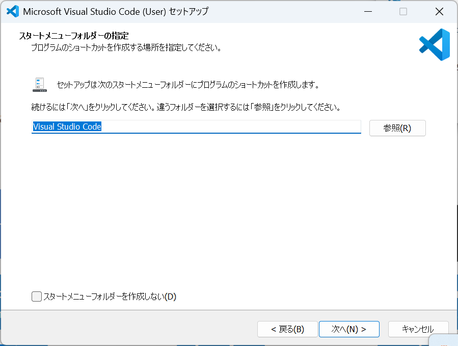
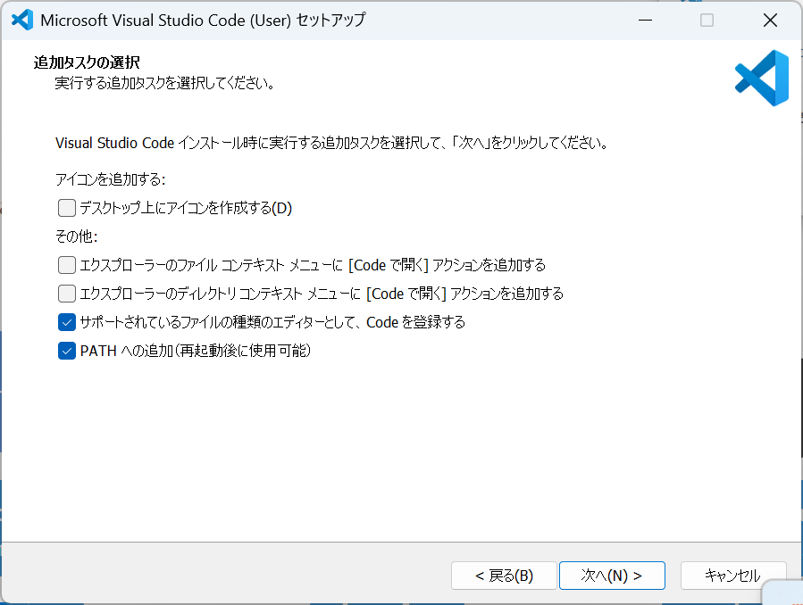
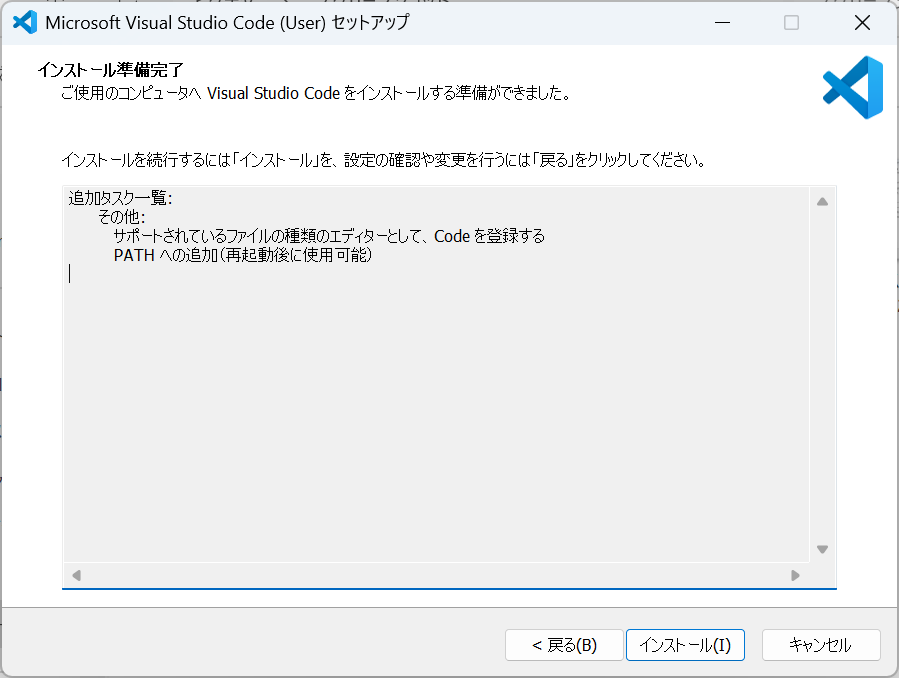
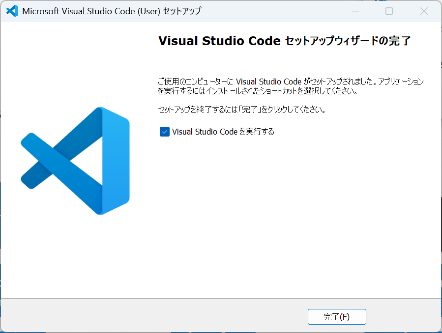

# インストール

### インストールの手順



Visual Studio Codeの[ダウンロードページ](https://code.visualstudio.com/download)にアクセスし、Windows用のインストーラーをダウンロードします。&#x20;

<figure><figcaption></figcaption></figure>



ダウンロードしたインストーラーを実行し、インストールを行います。



「同意する」にチェックを入れ、「次へ」をクリックします。

<figure><figcaption></figcaption></figure>



インストール先のフォルダを指定し、「次へ」をクリックします。

<figure><figcaption></figcaption></figure>



スタートメニューフォルダの指定画面で、「次へ」をクリックします。

<figure><figcaption></figcaption></figure>



追加タスクの選択画面で、「次へ」をクリックします。

<figure><figcaption></figcaption></figure>



「インストール」をクリックします。

<figure><figcaption></figcaption></figure>



インストールが完了すると、「完了」をクリックします。

<figure><figcaption></figcaption></figure>



### フォルダーを開く

1. Visual Studio Codeを起動します。
2. メニューから「File」→「Open Folder」を選択します。
3. 開きたいフォルダを選択し、「フォルダーの選択」をクリックします。
